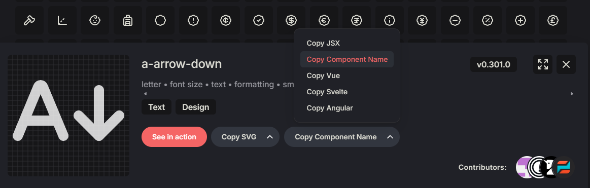

<p align="center">
  <a href="https://github.com/cnlancehu/lucide-slint#gh-light-mode-only">
    
  </a>
  <a href="https://github.com/cnlancehu/lucide-slint#gh-dark-mode-only">
    
  </a>
</p>

<p align="center">
  <a href="https://crates.io/crates/lucide-slint"></a>
</p>

<p align="center">
  <a href="https://crates.io/crates/lucide-slint">crates.io</a>
  ·
  <a href="https://docs.rs/lucide-slint/">Documentation</a>
</p>

## Lucide Slint
Implementation of the [lucide icon library](https://github.com/lucide-icons/lucide) for [Slint](https://github.com/slint-ui/slint).

**SVG-free !!!**

All icons are pre-converted to [Slint Path elements](https://docs.slint.dev/latest/docs/slint/reference/elements/path/), eliminating the overhead of runtime SVG rendering and reducing memory and CPU usage.

## ⚠️ Notice

**Lucide Slint 0.2.0** requires **Slint 1.15+** (will be released in the future) or the [master branch](https://github.com/slint-ui/slint/tree/master).

For **Slint 1.14.x**, please use **Lucide Slint [0.1.4](https://crates.io/crates/lucide-slint/0.1.4)** and refer to its [documentation](https://docs.rs/lucide-slint/0.1.4/lucide_slint/).

**Lucide Slint 0.2.0** depends on features introduced in [this PR](https://github.com/slint-ui/slint/pull/9912), which is not yet released in the stable version.

## Installation
In an existing Slint project, run the following command to add lucide-slint as a **build** dependency:

```bash
cargo add lucide-slint --build
```

Add the following to your `build.rs` file to import `lucide-slint` as a Slint library:

```rust
use std::{collections::HashMap, path::PathBuf};

fn main() {
    let library = HashMap::from([(
        "lucide".to_string(),
        PathBuf::from(lucide_slint::lib()),
    )]);
    let config = slint_build::CompilerConfiguration::new()
        .with_library_paths(library);

    // Specify your Slint code entry here
    slint_build::compile_with_config("ui/main.slint", config)
        .expect("Slint build failed");
}
```

## Usage
Then you can use lucide icons in your Slint files like this:

<image align="right" src="./assets/example1.webp" width="20%" />

<!-- example 1 -->
```slint
import { PlayIcon } from "@lucide";

export component App inherits Window {
    PlayIcon {
        stroke: #5E72E4;    // set the stroke color
        size: 48px;         // set the icon size
        stroke-width: 2;    // set the stroke width
    }
}
```


Or, you could just use icons with default `size`, `stroke` and `stroke-width`:

<image align="right" src="./assets/example2.webp" width="20%" />

<!-- example 2 -->
```slint
import { Columns3CogIcon } from "@lucide";

Columns3CogIcon { }
```

Modify the default values:

<image align="right" src="./assets/example3.webp" width="20%" />

```slint
import { PlayIcon, IconSettings } from "@lucide";

init => {
    IconSettings.default-stroke = #2dce89;
    IconSettings.default-size = 48px;
    IconSettings.default-stroke-width = 1.0;
}
PlayIcon { }
```

## Reference
### Icon Properties
All icons have the following properties:

| Property       | Type                                                                                 | Description                  | Default |
| -------------- | ------------------------------------------------------------------------------------ | ---------------------------- | ------- |
| `size`         | [length](https://docs.slint.dev/latest/docs/slint/reference/primitive-types/#length) | The size of the icon         | `24px`  |
| `stroke`       | [brush](https://docs.slint.dev/latest/docs/slint/reference/colors-and-brushes/#_top) | The stroke color of the icon | `white` |
| `stroke-width` | float  (unit: px)                                                                    | The stroke width of the icon | `2`     |

### Icon Out properties
All icons have the following out properties:

| Property                  | Type                                                                                 | Description                                                                                      |
| ------------------------- | ------------------------------------------------------------------------------------ | ------------------------------------------------------------------------------------------------ |
| `calculated-stroke-width` | [length](https://docs.slint.dev/latest/docs/slint/reference/primitive-types/#length) | The real stroke width of the icon calculated according to the `stroke-width` and `size` property |

## Available Icons

For a complete list of available icons, visit the [Lucide Icons](https://lucide.dev/icons/) website.

To use an icon in Slint:
1. Find your desired icon: `a-arrow-down`
2. Click **Copy Component Name** to get the PascalCase name: `AArrowDown`

3. Append `Icon` to the component name: `AArrowDownIcon`

**Example:**

```slint
import { AArrowDownIcon } from "@lucide";

AArrowDownIcon { }
```

## License
This project is licensed under the MIT License, while Lucide is licensed under [the ISC License](https://github.com/lucide-icons/lucide/blob/main/LICENSE).
